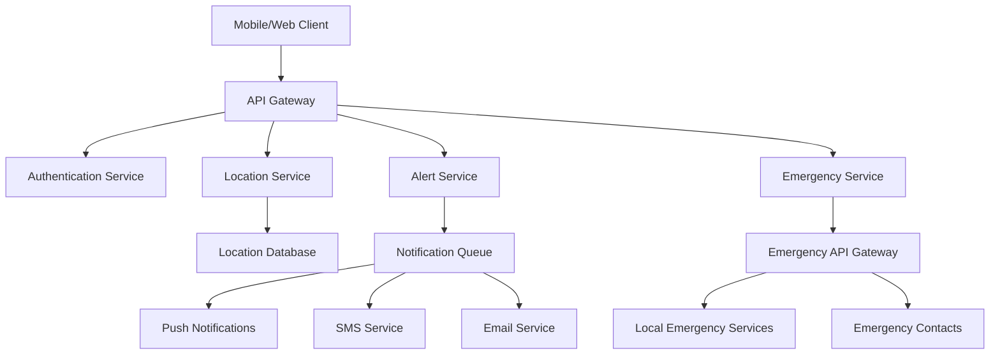

# Tourism Safety Tracker - Design Document

## Overview

The Tourism Safety Emergency Tracker will be built as a Python-based web application with mobile-responsive design, utilizing Flask/FastAPI for the backend, SQLite/PostgreSQL for data storage, and modern web technologies for the frontend. The system will integrate with mapping services, emergency APIs, and notification systems to provide comprehensive traveler safety monitoring.

## Architecture

### High-Level Architecture



### Technology Stack

**Backend:**
- **Framework:** FastAPI (Python 3.9+) for high-performance async API
- **Database:** PostgreSQL for production, SQLite for development
- **ORM:** SQLAlchemy with Alembic for migrations
- **Authentication:** JWT tokens with refresh mechanism
- **Task Queue:** Celery with Redis for background tasks
- **WebSocket:** For real-time location updates

**Frontend:**
- **Framework:** Progressive Web App (PWA) using vanilla JavaScript/TypeScript
- **Maps:** Leaflet.js with OpenStreetMap tiles
- **UI:** Tailwind CSS for responsive design
- **Offline:** Service Workers for offline functionality

**External Services:**
- **Geocoding:** OpenStreetMap Nominatim API
- **Routing:** OpenRouteService API
- **Notifications:** Firebase Cloud Messaging (FCM)
- **SMS:** Twilio API
- **Email:** SendGrid API

## Components and Interfaces

### 1. User Management Component

**Purpose:** Handle user registration, authentication, and profile management

**Key Classes:**
```python
class User:
    id: UUID
    email: str
    phone: str
    emergency_contacts: List[EmergencyContact]
    created_at: datetime
    is_active: bool

class EmergencyContact:
    id: UUID
    user_id: UUID
    name: str
    phone: str
    email: str
    relationship: str
    notification_preferences: Dict
```

**Interfaces:**
- `POST /api/auth/register` - User registration
- `POST /api/auth/login` - User authentication
- `GET /api/users/profile` - Get user profile
- `PUT /api/users/profile` - Update user profile
- `POST /api/users/emergency-contacts` - Add emergency contact

### 2. Trip Management Component

**Purpose:** Manage travel itineraries, planned locations, and trip settings

**Key Classes:**
```python
class Trip:
    id: UUID
    user_id: UUID
    name: str
    start_date: datetime
    end_date: datetime
    planned_locations: List[PlannedLocation]
    monitoring_settings: MonitoringSettings
    shared_with: List[UUID]

class PlannedLocation:
    id: UUID
    trip_id: UUID
    name: str
    latitude: float
    longitude: float
    arrival_time: datetime
    departure_time: datetime
    radius_meters: int
    location_type: LocationType

class MonitoringSettings:
    deviation_threshold_meters: int = 2000
    alert_timeout_minutes: int = 15
    check_in_interval_minutes: int = 60
    emergency_escalation_enabled: bool = True
```

**Interfaces:**
- `POST /api/trips` - Create new trip
- `GET /api/trips` - List user trips
- `PUT /api/trips/{trip_id}` - Update trip details
- `POST /api/trips/{trip_id}/locations` - Add planned location
- `POST /api/trips/{trip_id}/share` - Share trip with contacts

### 3. Location Tracking Component

**Purpose:** Collect, process, and analyze real-time location data

**Key Classes:**
```python
class LocationUpdate:
    id: UUID
    user_id: UUID
    trip_id: UUID
    latitude: float
    longitude: float
    accuracy_meters: float
    timestamp: datetime
    battery_level: int
    network_type: str

class GeofenceMonitor:
    def check_location_deviation(self, location: LocationUpdate, trip: Trip) -> DeviationResult
    def calculate_route_distance(self, current: Point, planned_route: List[Point]) -> float
    def is_within_safe_zone(self, location: LocationUpdate, safe_zones: List[PlannedLocation]) -> bool

class LocationProcessor:
    def process_location_update(self, location: LocationUpdate) -> ProcessingResult
    def detect_anomalies(self, recent_locations: List[LocationUpdate]) -> List[Anomaly]
```

**Interfaces:**
- `POST /api/location/update` - Submit location update
- `GET /api/location/current/{user_id}` - Get current location (for shared users)
- `GET /api/location/history/{trip_id}` - Get location history
- `WebSocket /ws/location/{trip_id}` - Real-time location streaming

### 4. Alert and Emergency System

**Purpose:** Manage safety alerts, user responses, and emergency escalation

**Key Classes:**
```python
class SafetyAlert:
    id: UUID
    user_id: UUID
    trip_id: UUID
    alert_type: AlertType
    triggered_at: datetime
    location: LocationUpdate
    status: AlertStatus
    user_response: Optional[str]
    escalated_at: Optional[datetime]

class EmergencyEscalation:
    id: UUID
    alert_id: UUID
    emergency_services_contacted: bool
    contacts_notified: List[UUID]
    escalation_details: Dict
    created_at: datetime

class AlertManager:
    def trigger_safety_alert(self, user_id: UUID, reason: str, location: LocationUpdate) -> SafetyAlert
    def process_user_response(self, alert_id: UUID, response: str) -> bool
    def escalate_to_emergency(self, alert: SafetyAlert) -> EmergencyEscalation
```

**Interfaces:**
- `GET /api/alerts/active` - Get active alerts for user
- `POST /api/alerts/{alert_id}/respond` - Respond to safety alert
- `POST /api/alerts/manual` - Manually trigger alert
- `GET /api/alerts/history` - Get alert history

### 5. Notification System

**Purpose:** Handle push notifications, SMS, and email communications

**Key Classes:**
```python
class NotificationService:
    def send_push_notification(self, user_id: UUID, message: str, data: Dict) -> bool
    def send_sms(self, phone: str, message: str) -> bool
    def send_email(self, email: str, subject: str, body: str) -> bool
    def notify_emergency_contacts(self, user: User, alert: SafetyAlert) -> List[NotificationResult]

class NotificationTemplate:
    safety_alert: str = "Safety check: Are you okay? Tap to respond."
    emergency_escalation: str = "EMERGENCY: {user_name} may need assistance at {location}"
    location_share: str = "{user_name} is sharing their location with you"
```

## Data Models

### Database Schema

```sql
-- Users and Authentication
CREATE TABLE users (
    id UUID PRIMARY KEY,
    email VARCHAR(255) UNIQUE NOT NULL,
    phone VARCHAR(20),
    password_hash VARCHAR(255) NOT NULL,
    created_at TIMESTAMP DEFAULT NOW(),
    is_active BOOLEAN DEFAULT TRUE
);

-- Emergency Contacts
CREATE TABLE emergency_contacts (
    id UUID PRIMARY KEY,
    user_id UUID REFERENCES users(id),
    name VARCHAR(255) NOT NULL,
    phone VARCHAR(20),
    email VARCHAR(255),
    relationship VARCHAR(100),
    notification_preferences JSONB,
    created_at TIMESTAMP DEFAULT NOW()
);

-- Trips and Itineraries
CREATE TABLE trips (
    id UUID PRIMARY KEY,
    user_id UUID REFERENCES users(id),
    name VARCHAR(255) NOT NULL,
    start_date TIMESTAMP,
    end_date TIMESTAMP,
    monitoring_settings JSONB,
    created_at TIMESTAMP DEFAULT NOW(),
    is_active BOOLEAN DEFAULT TRUE
);

-- Planned Locations
CREATE TABLE planned_locations (
    id UUID PRIMARY KEY,
    trip_id UUID REFERENCES trips(id),
    name VARCHAR(255) NOT NULL,
    latitude DECIMAL(10, 8) NOT NULL,
    longitude DECIMAL(11, 8) NOT NULL,
    arrival_time TIMESTAMP,
    departure_time TIMESTAMP,
    radius_meters INTEGER DEFAULT 1000,
    location_type VARCHAR(50),
    created_at TIMESTAMP DEFAULT NOW()
);

-- Location Updates
CREATE TABLE location_updates (
    id UUID PRIMARY KEY,
    user_id UUID REFERENCES users(id),
    trip_id UUID REFERENCES trips(id),
    latitude DECIMAL(10, 8) NOT NULL,
    longitude DECIMAL(11, 8) NOT NULL,
    accuracy_meters REAL,
    timestamp TIMESTAMP NOT NULL,
    battery_level INTEGER,
    network_type VARCHAR(20),
    created_at TIMESTAMP DEFAULT NOW()
);

-- Safety Alerts
CREATE TABLE safety_alerts (
    id UUID PRIMARY KEY,
    user_id UUID REFERENCES users(id),
    trip_id UUID REFERENCES trips(id),
    alert_type VARCHAR(50) NOT NULL,
    triggered_at TIMESTAMP NOT NULL,
    location_data JSONB,
    status VARCHAR(20) DEFAULT 'active',
    user_response TEXT,
    escalated_at TIMESTAMP,
    created_at TIMESTAMP DEFAULT NOW()
);

-- Trip Sharing
CREATE TABLE trip_shares (
    id UUID PRIMARY KEY,
    trip_id UUID REFERENCES trips(id),
    shared_with_user_id UUID REFERENCES users(id),
    permission_level VARCHAR(20) DEFAULT 'view',
    created_at TIMESTAMP DEFAULT NOW()
);
```

## Error Handling

### Error Categories and Responses

1. **Location Service Errors**
   - GPS unavailable: Graceful degradation to network-based location
   - Poor accuracy: Request user confirmation for critical alerts
   - Service timeout: Retry with exponential backoff

2. **Emergency Service Integration Errors**
   - API failure: Fall back to direct SMS/call to emergency contacts
   - Rate limiting: Queue requests and implement circuit breaker
   - Invalid location data: Use last known good location with timestamp

3. **Network Connectivity Issues**
   - Offline mode: Cache data locally, sync when connection restored
   - Partial connectivity: Prioritize emergency communications
   - High latency: Adjust timeout values dynamically

4. **User Response Handling**
   - Missed alerts: Implement progressive escalation (push → SMS → call)
   - False positives: Learn from user feedback to improve detection
   - Device issues: Provide alternative check-in methods

### Error Response Format

```python
class APIError:
    error_code: str
    message: str
    details: Optional[Dict]
    timestamp: datetime
    request_id: str

# Example error responses
{
    "error_code": "LOCATION_SERVICE_UNAVAILABLE",
    "message": "Unable to determine current location",
    "details": {"suggested_action": "Enable GPS or check network connection"},
    "timestamp": "2024-01-15T10:30:00Z",
    "request_id": "req_123456"
}
```

## Testing Strategy

### Unit Testing
- **Coverage Target:** >80% code coverage
- **Framework:** pytest with pytest-asyncio for async code
- **Mocking:** Mock external APIs (maps, emergency services, notifications)
- **Test Categories:**
  - Location processing algorithms
  - Alert triggering logic
  - Emergency escalation workflows
  - Data validation and sanitization

### Integration Testing
- **API Testing:** Test all REST endpoints with various scenarios
- **Database Testing:** Test data persistence and retrieval
- **External Service Testing:** Test with mock services and staging APIs
- **WebSocket Testing:** Test real-time location updates

### End-to-End Testing
- **User Workflows:** Complete trip creation to emergency escalation
- **Cross-Platform Testing:** Web and mobile responsive design
- **Performance Testing:** Location processing under load
- **Security Testing:** Authentication, authorization, and data protection

### Testing Data and Scenarios

```python
# Test scenarios for location deviation detection
test_scenarios = [
    {
        "name": "normal_travel",
        "planned_route": [(40.7128, -74.0060), (40.7589, -73.9851)],
        "actual_locations": [(40.7200, -74.0000), (40.7400, -73.9900)],
        "expected_alerts": 0
    },
    {
        "name": "significant_deviation",
        "planned_route": [(40.7128, -74.0060), (40.7589, -73.9851)],
        "actual_locations": [(40.6892, -74.0445)],  # 3km off route
        "expected_alerts": 1
    },
    {
        "name": "emergency_scenario",
        "planned_route": [(40.7128, -74.0060)],
        "actual_locations": [(40.7128, -74.0060)],  # Stationary for >4 hours
        "stationary_duration": 300,  # 5 hours in minutes
        "expected_alerts": 1
    }
]
```

This design provides a robust, scalable foundation for the tourism safety tracker while maintaining code quality suitable for collaborative GitHub development. The modular architecture allows for incremental development and testing of individual components.